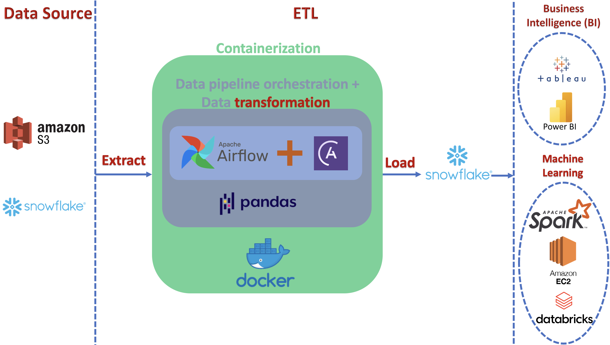

# Airflow Data Pipeline
## Introduction
This project is a data pipeline designed to automate the process of extracting, transforming, and loading data from various sources into a Snowflake database. It streamlines the ETL (Extract, Transform, Load) process by utilizing Apache Airflow's DAGs (Directed Acyclic Graphs) to orchestrate and schedule tasks.

## Project Overview
The primary goal of this data pipeline is to enable the seamless flow of data from source to destination while applying necessary transformations. It achieves this through a series of orchestrated tasks within an Airflow DAG. Here's an overview of the key components:

## DAG Overview
The Airflow DAG ('purchase_orders_pipeline') orchestrates the following tasks:

## Task 1: Load Data from S3
This task fetches data from an S3 bucket ('s3://airflow-astro-sdk-project/orders_data_header.csv') and loads it into a temporary Snowflake table. It establishes a connection with AWS using the 'aws_default' connection ID.

## Task 2: Retrieve Customers Table
Task 2 retrieves the 'customers_table' from Snowflake using the 'snowflake_default' connection ID.

## Task 3: Filter and Join Orders with Customers
This task filters orders with an amount greater than $150 and then joins these filtered orders with the 'customers_table' from Snowflake. The resulting dataset is stored in a temporary table.

## Task 4: Merge Data into Reporting Table
Task 4 merges the filtered and joined data into a 'reporting_table' in Snowflake. It handles conflicts using the "update" strategy.

## Task 5: Transform Data to DataFrame
This task transforms the 'reporting_table' in Snowflake into a Pandas DataFrame. It applies various data transformations, including converting column names to lowercase, calculating total purchase amounts, and creating additional columns such as 'year' and 'avg_purchase_per_year'. It also filters for high-value customers with a total purchase amount greater than $300.

## Task 6: Create Reporting Table in Snowflake
Task 6 runs a raw SQL statement to create the 'reporting_table_essential' in Snowflake if it doesn't already exist.

## Task 7: Append Transformed Data to Reporting Table
Task 7 appends the transformed data from the Pandas DataFrame back into the 'reporting_table_essential' in Snowflake.

## Task 8: Cleanup
The final task, 'cleanup', is responsible for removing any temporary tables or data created during the pipeline execution.

## Dependencies
+ Apache Airflow
+ Astro CLI
+ Docker
+ Snowflake database
+ AWS S3
+ Pandas
+ Minio (to set up a custom XCom backend)

## Configuration
The configuration of this project mainly revolves around setting up the required connections in Apache Airflow. Ensure that you have the necessary AWS and Snowflake connection details configured.

## Conclusion
This Airflow-based data pipeline showcases key principles of modern data engineering. Its modular design, meticulous task dependencies, advanced data transformation, conflict resolution strategies, and automation exemplify best practices in ETL processes.

The 'purchase_orders_pipeline' pipeline highlights the synergy of technology and methodology, with the potential to enhance data-driven decision-making in academia and industry.